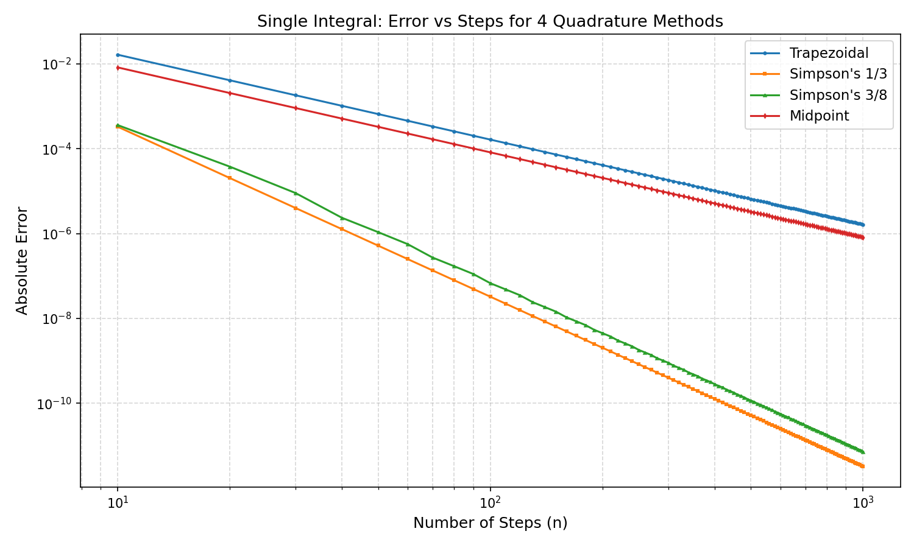
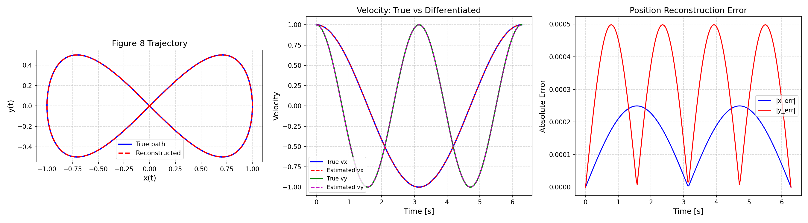

# 🎯 Optical Flow — Numerical Differentiation & Integration

> **ECE 5110-01: Numerical Modeling** — Cal Poly Pomona  
> Unit 3 Seminar: Numerical Differentiation & Integration Applied to Optical Flow

A Python implementation of the **Lucas-Kanade optical flow** algorithm built from scratch using numerical methods — no black-box OpenCV optical flow functions. Includes a real-time **webcam demo** with HSV flow visualization.

---

## 👥 Team

Jared Acosta · Jake Davila · Jack Gaon · Jacky Li · Virgil Nhieu · Elijah Perez · Josiah Wiggins · Richie Wong

---

## 📂 Repository Structure

```
.
├── lib/
│   └── tools.py                  # All numerical methods (no plots/prints)
├── unit03.py                     # Unit test: integration, differentiation, optical flow
├── webcam_demo.py                # Live webcam optical flow demo
├── article/
│   └── unit03.tex                # LaTeX article (IS&T two-column format)
├── slides/
│   ├── unit03_main.tex           # LaTeX slides (landscape presentation)
│   └── unit03_presentation.tex   # Full presentation script with speaker notes
├── templates/
│   └── presentation_template.tex # Reusable multi-speaker script template
├── .github/
│   ├── SKILL/                    # Step-by-step workflow instructions
│   │   ├── create-function-in-lib.md
│   │   ├── create-slides.md
│   │   ├── create-article.md
│   │   ├── create-unit-test.md
│   │   └── create-presentation-script.md
│   └── AGENTS/                   # AI agent instructions & workflows
│       ├── github-instructions.md
│       └── presentation-workflow.md
└── LICENSE.md
```

---

## 🚀 Quick Start

### Prerequisites

- **Python 3.8+**
- macOS / Linux / Windows

### 1. Clone the Repository

```bash
git clone https://github.com/Raymond-exe/optical-flow.git
cd optical-flow
```

### 2. Set Up Virtual Environment

```bash
python3 -m venv .venv
source .venv/bin/activate        # macOS / Linux
# .venv\Scripts\activate         # Windows
```

### 3. Install Dependencies

```bash
pip install numpy matplotlib opencv-python
```

### 4. Run the Unit Test

```bash
python unit03.py
```

This will:
- Compare 4 single-integral quadrature methods (n = 10 to 1000)
- Perform numerical differentiation on a figure-8 trajectory
- Solve the Lucas-Kanade matrix equation **(A<sup>T</sup>A)<sup>-1</sup>A<sup>T</sup>b**
- Compute a double integral over a 2D velocity field
- Generate two plots: `unit03_single_integral_comparison.png` and `unit03_optical_flow.png`

### 5. Run the Live Webcam Demo

```bash
python webcam_demo.py
```

> **Note:** Your terminal app needs **camera permission** on macOS.  
> Go to **System Settings → Privacy & Security → Camera** and enable your terminal.

Press **`q`** to quit the demo.

#### Webcam Demo Parameters (edit at top of `webcam_demo.py`)

| Parameter | Default | Description |
|-----------|---------|-------------|
| `scale` | `0.10` | Resolution factor (higher = finer tracking, slower) |
| `sensitivity` | `8000` | Flow color intensity (higher = more visible) |
| `frameOverlay` | `True` | Overlay flow on video (`False` = raw flow only) |
| `interpolateFlow` | `True` | Smooth bilinear upscaling (`False` = pixelated) |

---

## 🧮 Numerical Methods in `lib/tools.py`

All methods are implemented as class methods with **no plots or prints** — visualization is done exclusively in the unit test and demo files.

### Single Integral (4 forms)

| Method | Function | Order |
|--------|----------|-------|
| Trapezoidal | `integrate_trapezoidal(f, a, b, n)` | O(h²) |
| Simpson's 1/3 | `integrate_simpson13(f, a, b, n)` | O(h⁴) |
| Simpson's 3/8 | `integrate_simpson38(f, a, b, n)` | O(h⁴) |
| Midpoint | `integrate_midpoint(f, a, b, n)` | O(h²) |

### Double Integral (2 forms)

| Method | Function | Order |
|--------|----------|-------|
| Trapezoidal 2D | `integrate_double_trapezoidal(f, ax, bx, ay, by, nx, ny)` | O(h²) |
| Simpson 2D | `integrate_double_simpson(f, ax, bx, ay, by, nx, ny)` | O(h⁴) |

### Numerical Differentiation

| Function | Description |
|----------|-------------|
| `differentiate(y, h, method)` | Forward, backward, or central finite differences — O(h²) |

### Optical Flow

| Function | Description |
|----------|-------------|
| `optical_flow_lk(frame1, frame2, win)` | Full pipeline: float32 cast → NaN cleanup → Gaussian blur → Sobel gradients → Lucas-Kanade |
| `lucas_kanade_matrix(Ix, Iy, It, win)` | Window-based least-squares solve: **(A<sup>T</sup>A)<sup>-1</sup>A<sup>T</sup>b** via direct 2×2 determinant |

#### Noise Reduction Pipeline

1. `nan_to_num` — cleans NaN/Inf from the frame data
2. **Gaussian blur** (5×5) — suppresses sensor noise in bright regions
3. **Determinant check** — skips singular/low-texture windows
4. **Magnitude threshold** (in `webcam_demo.py`) — zeros out auto-exposure flicker

---

## 📊 Sample Output

### Quadrature Convergence (n = 10 to 1000)

Simpson's 1/3 and 3/8 rules converge as **O(h⁴)**, dramatically outperforming the O(h²) Trapezoidal and Midpoint rules.



### Optical Flow — Figure-8 Trajectory

The unit test differentiates position → velocity, then integrates velocity → reconstructed position, with close agreement to the analytical truth.



### Lucas-Kanade Matrix Calculation

A 5×5 synthetic pixel window recovers the true velocity vector (u, v) = (1.5, −0.8) from noisy gradient data using the least-squares normal equations.

---

## 📄 LaTeX Documents

| File | Description | Required Assets |
|------|-------------|----------------|
| `article/unit03.tex` | IS&T two-column article | `ist.sty` |
| `slides/unit03_main.tex` | Landscape presentation slides | `cpp_logo.png` |
| `slides/unit03_presentation.tex` | Full script with **speaker notes** for 7 presenters | `cpp_logo.png` + plot `.png` files |
| `templates/presentation_template.tex` | Reusable template with `<<placeholder>>` markers | `cpp_logo.png` |

### How to Compile

1. **Upload to [Overleaf](https://www.overleaf.com):**
   - Upload the `.tex` file you want to compile
   - Upload required assets into the **same folder** (see table above)
   - For slides/presentation: upload `cpp_logo.png`, `unit03_single_integral_comparison.png`, `unit03_optical_flow.png`
   - For the article: upload `ist.sty` and the plot `.png` files
   - Click **Recompile**

2. **Or compile locally:**
   ```bash
   cd slides
   pdflatex unit03_presentation.tex
   ```

### Speaker Notes Toggle

The presentation script (`unit03_presentation.tex`) supports two compile modes:

- **`\shownotestrue`** (default) — prints word-for-word speech in shaded boxes below each slide (speaker copy)
- **`\shownotesfalse`** — hides all notes, producing clean slides for the projector

---

## 🤖 SKILL & AGENTS

The `.github/` directory contains reusable instruction files for both **human contributors** and **AI coding agents**.

### SKILL Files (`.github/SKILL/`)

Step-by-step "how-to" guides:

| File | Purpose |
|------|---------|
| `create-function-in-lib.md` | Add a new numerical method to `lib/tools.py` |
| `create-unit-test.md` | Create a `unitNN.py` test file |
| `create-slides.md` | Create landscape LaTeX slides |
| `create-article.md` | Create an IS&T two-column article |
| `create-presentation-script.md` | Create a multi-speaker presentation script with speaker notes |

### AGENTS Files (`.github/AGENTS/`)

Workflow instructions for AI agents:

| File | Purpose |
|------|---------|
| `github-instructions.md` | Repo conventions, structure, and per-unit workflow |
| `presentation-workflow.md` | End-to-end workflow for generating a group presentation from the template |

---

## 📚 References

1. R. Burden, J. Faires, *Numerical Analysis*, 10th ed., Cengage, 2016.
2. B. Lucas, T. Kanade, "An iterative image registration technique with an application to stereo vision," *Proc. IJCAI*, pp. 674–679, 1981.
3. B. Horn, B. Schunck, "Determining optical flow," *Artificial Intelligence*, 17, 185–203, 1981.

---

## 📝 License

This project is for academic use as part of ECE 5110-01 at Cal Poly Pomona. See [LICENSE.md](LICENSE.md) for details.
